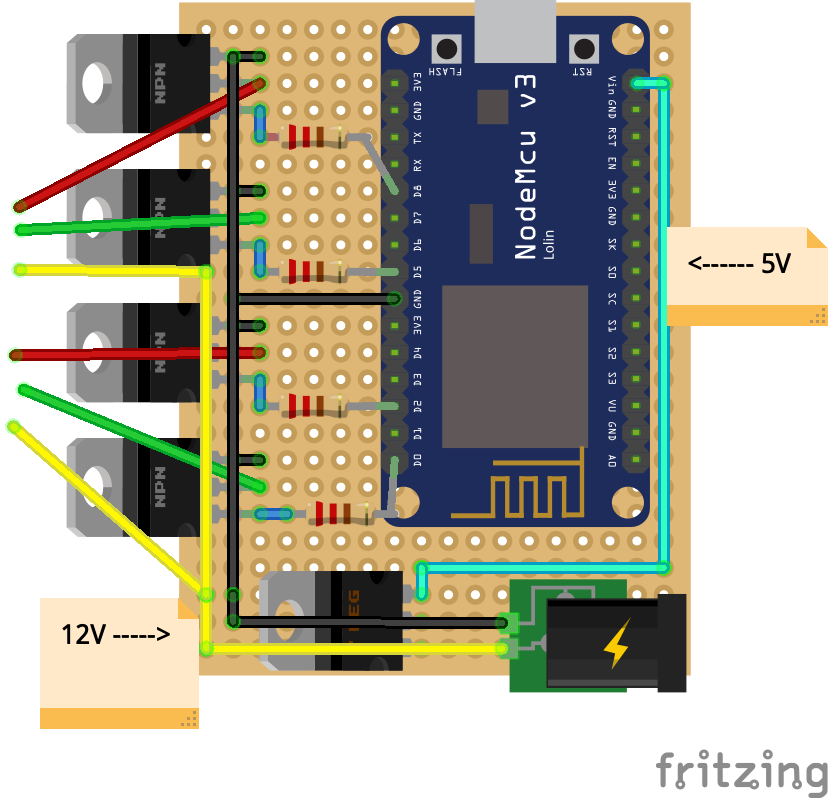

# Project Washer Dryer Interface

Creation Date: Mar 29, 2020 11:31 AM
Tags: project

# A washing machine/dryer status "illuminated sign"

## Summary:

An illuminated sign that indicates whether the dryer and/or washing machine is running, finished or off. An ESP8266 processes information and sends instructions over WiFi to another ESP8266, which is built into the illuminated sign, which light(s) to turn on or off. The "sign ESP8266" controls two separate LED strips which represent either the washing machine or dryer respectively. Since all logic is happening on the client which is not build into the sign, adjusting the programmed logic when your dryer or washer is on or off is easily modifiable to suit your needs. Theoretically, you can just build the sign and display whatever you want or modify the CAD file to make the illuminated sign "wall mountable" (like a clock). 

## Technical Details

### What you need:

1. 2x ESP8266
2. (based on number of appliances)x Photo-resistors 
3. 1x LED Strip
4. 3D printer
5. 2x Glass panes optimised for LED's
6. "Spritzspachtel" → Spray filler (to smoothen the 3D print)

### Software

Disclaimer: I started this project with 0.1 knowledge of programming. The code is bad, like really bad. 
- The first versions did not make use of objects (duplicate code for washer and dryer). After learning about object oriented programming that was implemented (but not from scratch).
- Did not know what HTTP requests or JSON files are. The communication is done via a HTTP Get request which send 4 boolean values (REST safe you know haha).  

**Client:** 

The ESP connected to the vibration sensors and PIR sensor is the client. All logic (appliance running etc.) is happening on the client. This ensures that the logic can easily be easily be modified because of the much easier access to the client ESP than the server ESP. Most appliances have light indicators if it is running or finished. The photo-resistors are placed above these lights. You have to figure out yourself which light does indicate what. The code detects if the light is blinking or continuously on and you can also specify multiple lights for an appliance. For example, my dryer has one led. This led blinks when the dryer is finished and is continuously on when it's running while the washer has two separate lights for on and finished.

The client sends four boolean values to the server which tell the server which lights to turn on like that: *[bool washerRunning(red light), bool washerFinished(green light), bool dryerRunning(red light), bool dryerFinished(green light)].* 

**Server:**

The server receives the instructions which lights to turn on and off by the client. This information is processed and to corresponding LED strips and colors are turned on or off. 

**Generally** the code is easy (and I think understandable). The only pitfall is that some logic is programmed within the classes itself. Especially the vibration sensor class. 

### Hardware

**Electronic Circuit** for the Server:

Since the server ESP is build into the sign itself but cannot be powered by 12V but the LED strips need 12V a small electronic circuit had to be developed. Again the disclaimer that I had no experience with electronics. I am sure there are things to improve. This is how the circuit looks like:

The circuit of the server ESP which is connected to the LED strips.

The board is 70x50mm.

The black box on the bottom right is a DC jack where the original LED strips power supply goes into. The original power supply gives out 12V which is represented by the yellow cable. Besides going directly to the LED strips, the 12V also go into a voltage regulator which lowers the voltage to 5V from which the ESP can be powered via the VIN pin (the cyan cable). I used a L78505CV voltage regulator. The four NPN transistors are used to turn on the corresponding colors on the LED strip. I used TIP120 transistors. The input pins from the transistors (most left) are connected to output pins of the ESP. In between each of this connections is 220 ohm resistor. The middle pin is the output for the LED strips. The most right pin is connected to the ground. 

**3D printed sign**

The 3D printed sign consists of 6 (+2 for the glasses) individual parts which are mostly put together by press fit and therefore easy to dismantle again. The dimensions are chosen to be printed by an Ender3 and that the LED strips are diffused by the plexiglass. The hardest part to get is likely the plexiglass. Alternatively, you could try to print a very thin layer with your 3D printer. If you live in Berlin, you can buy the plexiglass from ["Walter Weissig GmbH"](https://www.walterweissig.de/). It's a very old school company manufacturing everything around plexiglass in a typical Kreuzberger backyard since 1918. (These kind of manufacturing facilities are dying out, so if you are in Berlin, go there.)

1. The main case (print without the "glass frame", see point 4).
2. The led plate
3. A divider for the different cells which is glued onto the led plate
4. One "glass frame" which cannot be printed from one side and therefore has to be glued onto the main case. In order to print that part take the main case and only print the "frame" by "moving the case under build plate". This image after the list illustrates this trick.
5. The ESP case
6. A cover for the ESP case
7. (Photo-resistor "case").
8. (Plexiglass + transparent foil with icons printed on them), dimensions are found in stl folder, icons in icons
9. (Plexiglass + transparent foil with icons printed on them), dimensions are found in stl folder, icons in icons

    

    Print trick "under the buildplate". The orange line is the build plate.

## FAQ

**Why did you build this?**

I always forgot my laundry in the washing machine and dryer. The best solution to inform me when the dryer or washing machine is finished is when I walk by the "washing kitchen". (No annoying notifications!).

## Process

